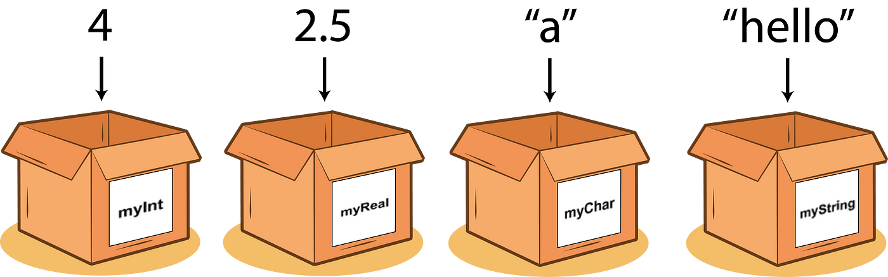

# PYTHON DASTURLASH ASOSLARI

## 1-dars O'zgaruvchilar va ma'lumot turlari.

- Mavzular:
    - O'zgaruvchilar, ma'lumot turlari (int, float, str, bool).
    - O'zgaruvchilarni e'lon qilish va ularga qiymat berish.

>[!NOTE]
> Python dasturlash tilida o'zgaruvchilar va ma'lumot turlari dasturlarni tuzishda juda muhim. Quyida o'zgaruvchilar va ularning turli ma'lumot turlari haqida ma'lumot beriladi.

## O'ZGARUVCHILAR

**O'zgaruvchi** - kompyuter xotirasida ma'lum bir qiymatni saqlash uchun ajratilgan joy. `Python`da o'zgaruvchi yaratish va unga qiymat berish juda oson:



Quyidagi misolda 4 ta o'zgaruvchi yaratdik (`x`, `y`, `name` va `is_student`) va ularga har xil ma'lumot yukladik.

```python
x = 5 # Butun son (int)
y = 3.14 # Haqiqiy son (float)
name = "Alice"  # Matn (str)
is_student = True  # Mantiqiy qiymat (bool)
print(x)
print(y)
print(name)
print(is_student)
```

Natija: <br>
`5` <br>
`3.14` <br>
`Alice` <br>
`True`

O'zgaruvchi (variable) diyilishini sababi uning qiymati istalgan payt o'zgarishi mumkin:

```python
ism = 'Alisher'
print(ism)
ism = "Muhammad"
print(ism)
```

Natija: <br>
`Alisher` <br>
`Muhammad`

Yuqoridagi misolda `ism` nomli o'zgaruvchiga avval `Alisher` keyin esa `Muhammad` deb qiymat berdik.

### O'ZGARUVCHILARNI NOMLASH
> [!CAUTION]
> O'zgaruvchilarga nom berishda quyidagi qoidalarga amal qiling:
> - O'zgaruvchi nomi harf yoki pastki chiziq (`_`) bilan boshlanishi kerak
> - O'zgaruvchi nomi raqam bilan boshlanishi mumkin emas
> - O'zgaruvchi nomida faqatgina lotin alifbosi harflari (`A-z`), raqamlar (`0-9`) va pastki chiziq (`_`) qatnashishi mumkin
> - O'zgaruvchi nomida bo'shliq (пробел) bo'lishi mumkin emas
> - O'zgaruvchi nomida katta-kichik harflar turlicha talqin qilinadi (`ism`, `ISM`, va `Ism` uchta turli o'zgaruvchi)

Qo'shimcha qoidalar:
- O'zgaruvchi nomini kichik harflar bilan yozing.
- O'zgaruvchi nomida 2 va undan ortiq so'z qatnashsa ularning orasini pastki chiziq (`_`) bilan ajrating (`ism_sharif="Umid G'aybullayev"`) 
- O'zgaruvchiga tushunarli nom bering (`y=20` emas `yosh=20`, `d="Korea"` emas `davlat = "Korea"` va hokazo)
- Shuningdek o'zgaruvchilarga Pythonda ishlatiladigan funktsiyalar va maxsus kalit so'zlarning (keywords) nomini bermang. Kalit so'zlar ro'yhatini ko'rish uchun python faylga  uyidagi kodni yozamiz:
```python
import keyword
print(keyword.kwlist)
```
Marhamat, ekraningizda Pythondagi maxsus kalit so'zlar ro'yhatini ko'ryapsiz:


## MA'LUMOT TURLARI
Python dasturlash tilida 7ta ma'lumot turi bor, ular quyidagilar:


- `String(str)` - Matnli ma'lumotlarni ifodalaydi. Masalan: `"hello"`, `'world'`, `"123"`.
- `Number` - Number ma'lumot turi 3ga bo'linadi.