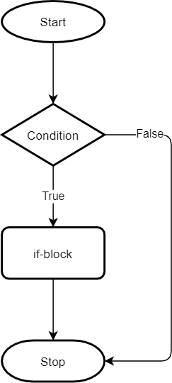

# PYTHON DASTURLASH ASOSLARI

## 6-dars Shart operatorlari

## TARMOQLANISH

Shu vaqtgacha yozgan dasturlarimizga e'tibor bersangiz, dasturimiz yuqoridan pastga qarab qatorma-qator bajarilib keldi. Bu chiziqli dastur deyiladi. Voqelikda esa aksar dasturlar ma'lum bir shart bajarilishi (yoki bajarilmaganiga) ko'ra kodning bir qismidan boshqa qismiga "sakrab" o'tishi tabiiy hol. Dasturlashda bu `tarmoqlanish` deb ataladi. 

